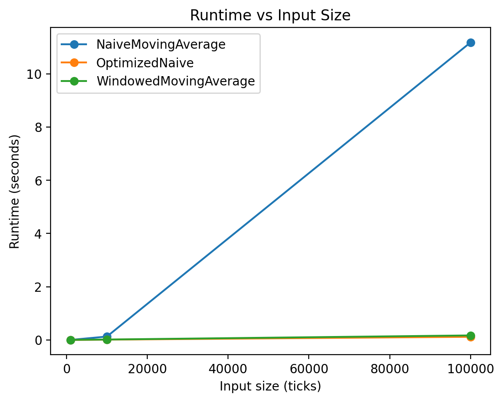
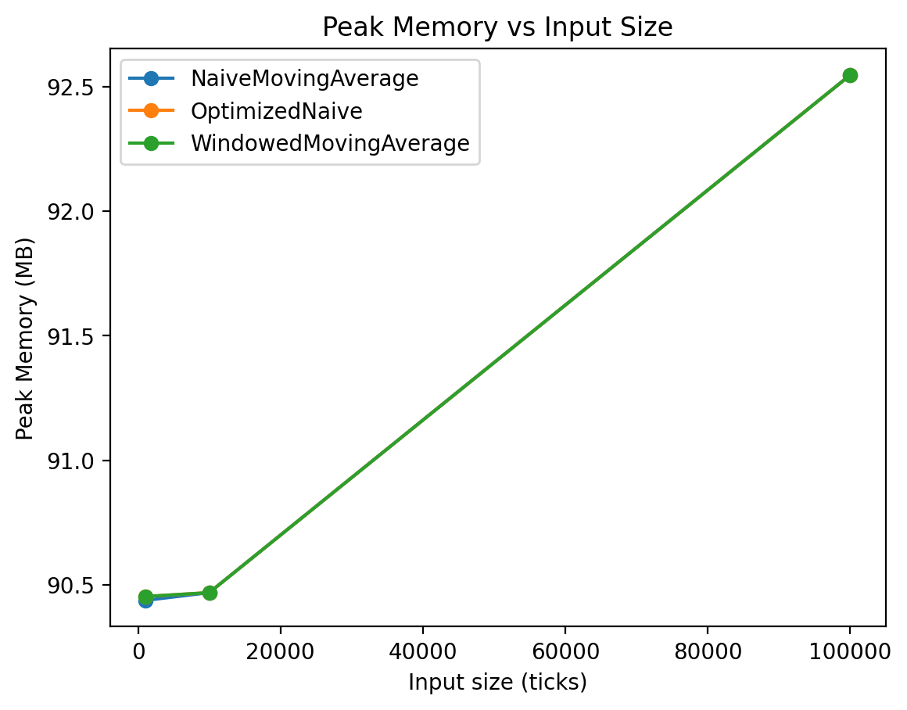

# Complexity Report

## Benchmark Metrics

| Strategy | Ticks | Runtime (s) | Peak Memory (MB) |
|---|---:|---:|---:|
| NaiveMovingAverage | 1000 | 0.002859 | 90.44 |
| NaiveMovingAverage | 10000 | 0.128949 | 90.47 |
| NaiveMovingAverage | 100000 | 11.176933 | 92.55 |
| OptimizedNaive | 1000 | 0.001324 | 90.45 |
| OptimizedNaive | 10000 | 0.012574 | 90.47 |
| OptimizedNaive | 100000 | 0.119942 | 92.55 |
| WindowedMovingAverage | 1000 | 0.004617 | 90.45 |
| WindowedMovingAverage | 10000 | 0.017210 | 90.47 |
| WindowedMovingAverage | 100000 | 0.171221 | 92.55 |

## Scaling Plots





## Big-O Complexity Annotations

- **NaiveMovingAverageStrategy**: per tick **O(n)** time (re-summing full history), **O(n)** space (store full history).

- **WindowedMovingAverageStrategy**: per tick **O(1)** time (running sum + fixed deque), **O(k)** space (window).

- **OptimizedNaiveMovingAverageStrategy**: per tick **O(1)** time (running sum + count), **O(1)** space.

## Notes on Concurrency (from Week2 slides)

- This benchmark is kept **single-threaded** to ensure repeatable profiling results. If multiple threads share state (e.g., history list, running_sum), you can get **race conditions**; fixing it requires a lock/critical section, which changes both runtime and profiling hotspots.

## cProfile Hotspots (Top Snippets)

### NaiveMovingAverage @ 1000 ticks

```text
6006 function calls in 0.003 seconds

   Ordered by: internal time

   ncalls  tottime  percall  cumtime  percall filename:lineno(function)
     1000    0.001    0.000    0.001    0.000 {built-in method builtins.sum}
     1000    0.001    0.000    0.003    0.000 /Users/kaitlyn/Documents/real-time/market-complexity/strategies.py:30(generate_signals)
     1000    0.001    0.000    0.001    0.000 <string>:2(__init__)
        1    0.000    0.000    0.003    0.003 /Users/kaitlyn/Documents/real-time/market-complexity/profiler.py:28(run_strategy)
     1000    0.000    0.000    0.000    0.000 {method 'append' of 'list' objects}
     2000    0.000    0.000    0.000    0.000 {built-in method builtins.len}
        1    0.000    0.000    0.000    0.000 {method 'disable' of '_lsprof.Profiler' objects}
        1    0.000    0.000    0.000    0.000 /Users/kaitlyn/Documents/real-time/market-complexity/main.py:24(<lambda>)
        1    0.000    0.000    0.000    0.000 /Users/kaitlyn/Documents/real-time/market-complexity/strategies.py:25(__init__)
        2    0.000    0.000    0.000    0.000 {built-in method time.perf_counter}
```

### NaiveMovingAverage @ 10000 ticks

```text
60006 function calls in 0.129 seconds

   Ordered by: internal time

   ncalls  tottime  percall  cumtime  percall filename:lineno(function)
    10000    0.107    0.000    0.107    0.000 {built-in method builtins.sum}
    10000    0.011    0.000    0.125    0.000 /Users/kaitlyn/Documents/real-time/market-complexity/strategies.py:30(generate_signals)
    10000    0.005    0.000    0.005    0.000 <string>:2(__init__)
        1    0.004    0.004    0.129    0.129 /Users/kaitlyn/Documents/real-time/market-complexity/profiler.py:28(run_strategy)
    20000    0.001    0.000    0.001    0.000 {built-in method builtins.len}
    10000    0.001    0.000    0.001    0.000 {method 'append' of 'list' objects}
        1    0.000    0.000    0.000    0.000 {method 'disable' of '_lsprof.Profiler' objects}
        1    0.000    0.000    0.000    0.000 /Users/kaitlyn/Documents/real-time/market-complexity/main.py:24(<lambda>)
        2    0.000    0.000    0.000    0.000 {built-in method time.perf_counter}
        1    0.000    0.000    0.000    0.000 /Users/kaitlyn/Documents/real-time/market-complexity/strategies.py:25(__init__)
```

### NaiveMovingAverage @ 100000 ticks

```text
600006 function calls in 11.177 seconds

   Ordered by: internal time

   ncalls  tottime  percall  cumtime  percall filename:lineno(function)
   100000   10.934    0.000   10.934    0.000 {built-in method builtins.sum}
   100000    0.134    0.000   11.137    0.000 /Users/kaitlyn/Documents/real-time/market-complexity/strategies.py:30(generate_signals)
   100000    0.054    0.000    0.054    0.000 <string>:2(__init__)
        1    0.035    0.035   11.177   11.177 /Users/kaitlyn/Documents/real-time/market-complexity/profiler.py:28(run_strategy)
   200000    0.012    0.000    0.012    0.000 {built-in method builtins.len}
   100000    0.008    0.000    0.008    0.000 {method 'append' of 'list' objects}
        1    0.000    0.000    0.000    0.000 {method 'disable' of '_lsprof.Profiler' objects}
        1    0.000    0.000    0.000    0.000 /Users/kaitlyn/Documents/real-time/market-complexity/main.py:24(<lambda>)
        2    0.000    0.000    0.000    0.000 {built-in method time.perf_counter}
        1    0.000    0.000    0.000    0.000 /Users/kaitlyn/Documents/real-time/market-complexity/strategies.py:25(__init__)
```

### OptimizedNaive @ 1000 ticks

```text
3006 function calls in 0.001 seconds

   Ordered by: internal time

   ncalls  tottime  percall  cumtime  percall filename:lineno(function)
     1000    0.001    0.000    0.001    0.000 <string>:2(__init__)
     1000    0.000    0.000    0.001    0.000 /Users/kaitlyn/Documents/real-time/market-complexity/strategies.py:104(generate_signals)
        1    0.000    0.000    0.001    0.001 /Users/kaitlyn/Documents/real-time/market-complexity/profiler.py:28(run_strategy)
     1000    0.000    0.000    0.000    0.000 {built-in method builtins.len}
        1    0.000    0.000    0.000    0.000 {method 'disable' of '_lsprof.Profiler' objects}
        1    0.000    0.000    0.000    0.000 /Users/kaitlyn/Documents/real-time/market-complexity/main.py:26(<lambda>)
        1    0.000    0.000    0.000    0.000 /Users/kaitlyn/Documents/real-time/market-complexity/strategies.py:99(__init__)
        2    0.000    0.000    0.000    0.000 {built-in method time.perf_counter}
```

### OptimizedNaive @ 10000 ticks

```text
30006 function calls in 0.013 seconds

   Ordered by: internal time

   ncalls  tottime  percall  cumtime  percall filename:lineno(function)
    10000    0.005    0.000    0.005    0.000 <string>:2(__init__)
    10000    0.005    0.000    0.010    0.000 /Users/kaitlyn/Documents/real-time/market-complexity/strategies.py:104(generate_signals)
        1    0.002    0.002    0.013    0.013 /Users/kaitlyn/Documents/real-time/market-complexity/profiler.py:28(run_strategy)
    10000    0.001    0.000    0.001    0.000 {built-in method builtins.len}
        1    0.000    0.000    0.000    0.000 {method 'disable' of '_lsprof.Profiler' objects}
        1    0.000    0.000    0.000    0.000 /Users/kaitlyn/Documents/real-time/market-complexity/main.py:26(<lambda>)
        2    0.000    0.000    0.000    0.000 {built-in method time.perf_counter}
        1    0.000    0.000    0.000    0.000 /Users/kaitlyn/Documents/real-time/market-complexity/strategies.py:99(__init__)
```

### OptimizedNaive @ 100000 ticks

```text
300006 function calls in 0.120 seconds

   Ordered by: internal time

   ncalls  tottime  percall  cumtime  percall filename:lineno(function)
   100000    0.049    0.000    0.049    0.000 <string>:2(__init__)
   100000    0.045    0.000    0.094    0.000 /Users/kaitlyn/Documents/real-time/market-complexity/strategies.py:104(generate_signals)
        1    0.021    0.021    0.120    0.120 /Users/kaitlyn/Documents/real-time/market-complexity/profiler.py:28(run_strategy)
   100000    0.005    0.000    0.005    0.000 {built-in method builtins.len}
        1    0.000    0.000    0.000    0.000 {method 'disable' of '_lsprof.Profiler' objects}
        1    0.000    0.000    0.000    0.000 /Users/kaitlyn/Documents/real-time/market-complexity/main.py:26(<lambda>)
        1    0.000    0.000    0.000    0.000 /Users/kaitlyn/Documents/real-time/market-complexity/strategies.py:99(__init__)
        2    0.000    0.000    0.000    0.000 {built-in method time.perf_counter}
```

### WindowedMovingAverage @ 1000 ticks

```text
6006 function calls in 0.005 seconds

   Ordered by: internal time

   ncalls  tottime  percall  cumtime  percall filename:lineno(function)
     1000    0.002    0.000    0.004    0.000 /Users/kaitlyn/Documents/real-time/market-complexity/strategies.py:63(generate_signals)
     1000    0.001    0.000    0.001    0.000 <string>:2(__init__)
        1    0.001    0.001    0.005    0.005 /Users/kaitlyn/Documents/real-time/market-complexity/profiler.py:28(run_strategy)
     3000    0.000    0.000    0.000    0.000 {built-in method builtins.len}
     1000    0.000    0.000    0.000    0.000 {method 'append' of 'collections.deque' objects}
        1    0.000    0.000    0.000    0.000 {method 'disable' of '_lsprof.Profiler' objects}
        1    0.000    0.000    0.000    0.000 /Users/kaitlyn/Documents/real-time/market-complexity/strategies.py:56(__init__)
        1    0.000    0.000    0.000    0.000 /Users/kaitlyn/Documents/real-time/market-complexity/main.py:25(<lambda>)
        2    0.000    0.000    0.000    0.000 {built-in method time.perf_counter}
```

### WindowedMovingAverage @ 10000 ticks

```text
60006 function calls in 0.017 seconds

   Ordered by: internal time

   ncalls  tottime  percall  cumtime  percall filename:lineno(function)
    10000    0.008    0.000    0.015    0.000 /Users/kaitlyn/Documents/real-time/market-complexity/strategies.py:63(generate_signals)
    10000    0.005    0.000    0.005    0.000 <string>:2(__init__)
        1    0.002    0.002    0.017    0.017 /Users/kaitlyn/Documents/real-time/market-complexity/profiler.py:28(run_strategy)
    30000    0.002    0.000    0.002    0.000 {built-in method builtins.len}
    10000    0.001    0.000    0.001    0.000 {method 'append' of 'collections.deque' objects}
        1    0.000    0.000    0.000    0.000 {method 'disable' of '_lsprof.Profiler' objects}
        1    0.000    0.000    0.000    0.000 /Users/kaitlyn/Documents/real-time/market-complexity/strategies.py:56(__init__)
        1    0.000    0.000    0.000    0.000 /Users/kaitlyn/Documents/real-time/market-complexity/main.py:25(<lambda>)
        2    0.000    0.000    0.000    0.000 {built-in method time.perf_counter}
```

### WindowedMovingAverage @ 100000 ticks

```text
600006 function calls in 0.171 seconds

   Ordered by: internal time

   ncalls  tottime  percall  cumtime  percall filename:lineno(function)
   100000    0.076    0.000    0.145    0.000 /Users/kaitlyn/Documents/real-time/market-complexity/strategies.py:63(generate_signals)
   100000    0.052    0.000    0.052    0.000 <string>:2(__init__)
        1    0.021    0.021    0.171    0.171 /Users/kaitlyn/Documents/real-time/market-complexity/profiler.py:28(run_strategy)
   300000    0.015    0.000    0.015    0.000 {built-in method builtins.len}
   100000    0.007    0.000    0.007    0.000 {method 'append' of 'collections.deque' objects}
        1    0.000    0.000    0.000    0.000 /Users/kaitlyn/Documents/real-time/market-complexity/strategies.py:56(__init__)
        1    0.000    0.000    0.000    0.000 {method 'disable' of '_lsprof.Profiler' objects}
        1    0.000    0.000    0.000    0.000 /Users/kaitlyn/Documents/real-time/market-complexity/main.py:25(<lambda>)
        2    0.000    0.000    0.000    0.000 {built-in method time.perf_counter}
```
